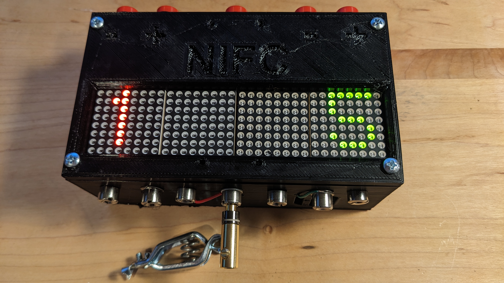
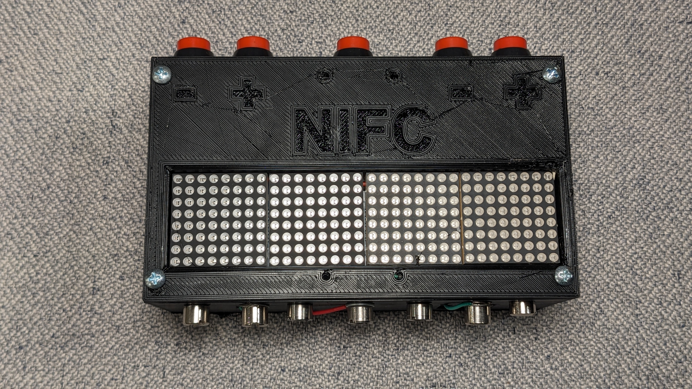
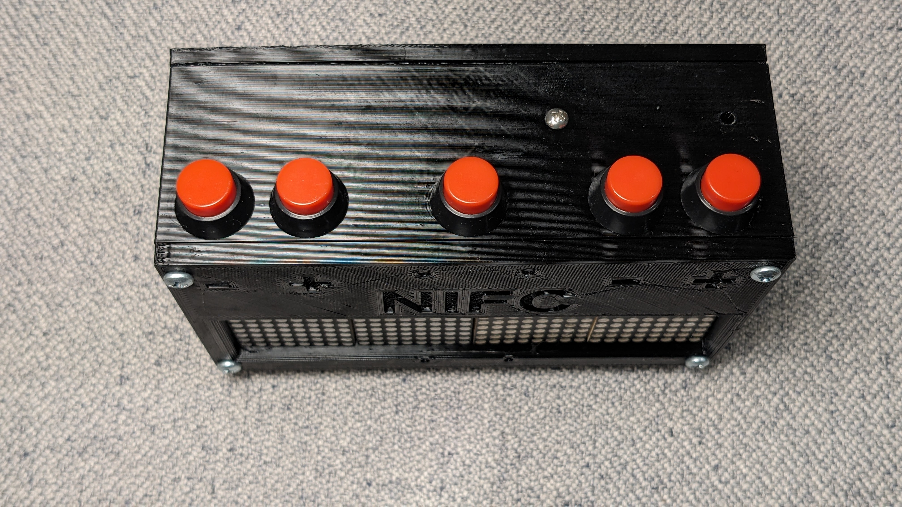
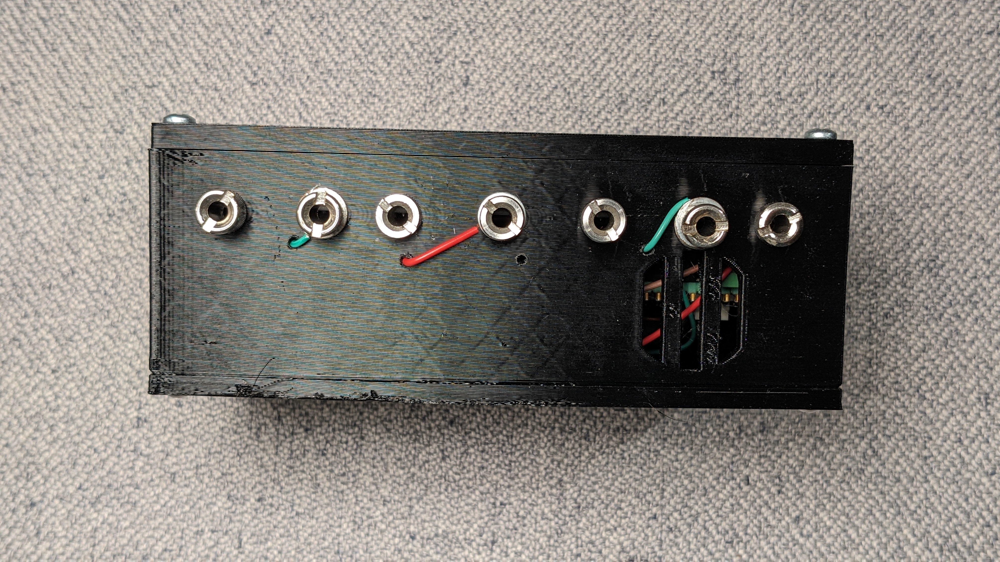
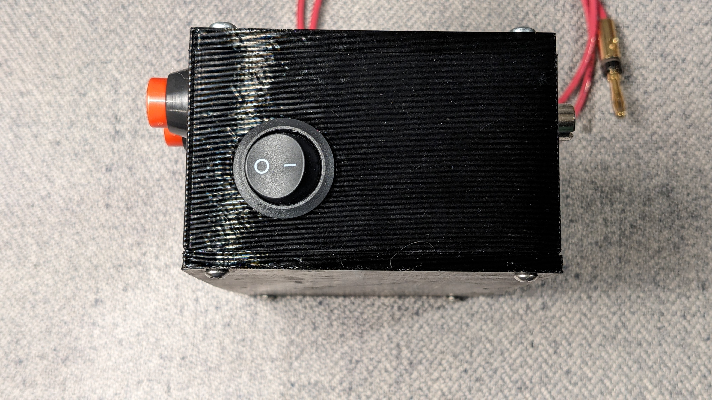
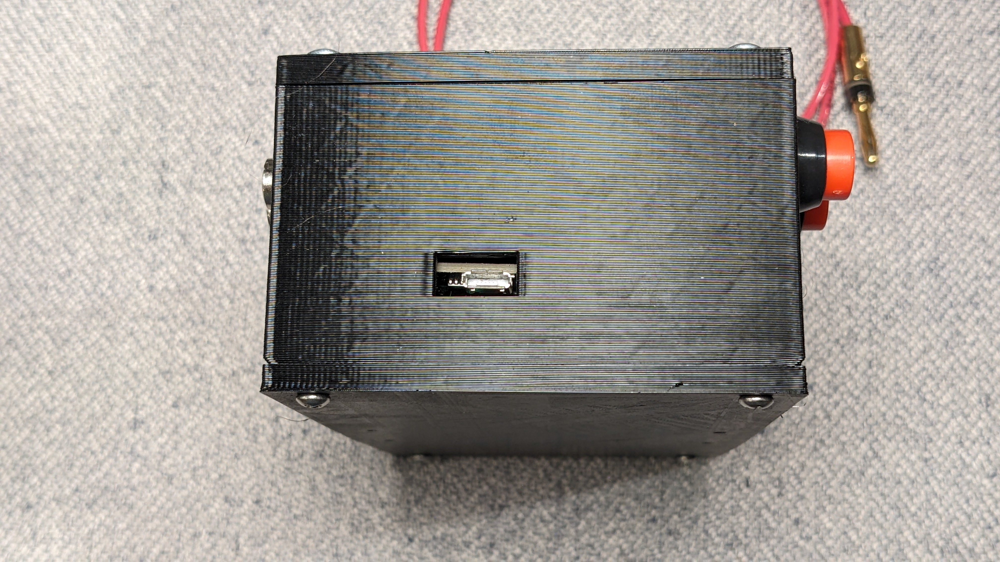

# SaberGame Olymipic-style Saber Speed Training Aid

SaberGame is a simple hardware training tool to allow two fencers to comete against each other in off-the-line speed.  A director calls "fence" and the first fencer to touch a mask (and lame, if you want) centered between them gets a point.  It's essenially a scoring box in Saber mode with a very, very short lockout time.

| front | top | bottom | left | right |
| - | - | - | - | -|
|  |  |  |  | 

Included are the code, [bill-of-materials](Docs/bom.md), [STL files](Hardware) for printing the enclosure and the [schematic](Docs/Schematic_SaberGame_v1.0.pdf).

PRs, feature requests, bug fixes, etc. are all welcome.
